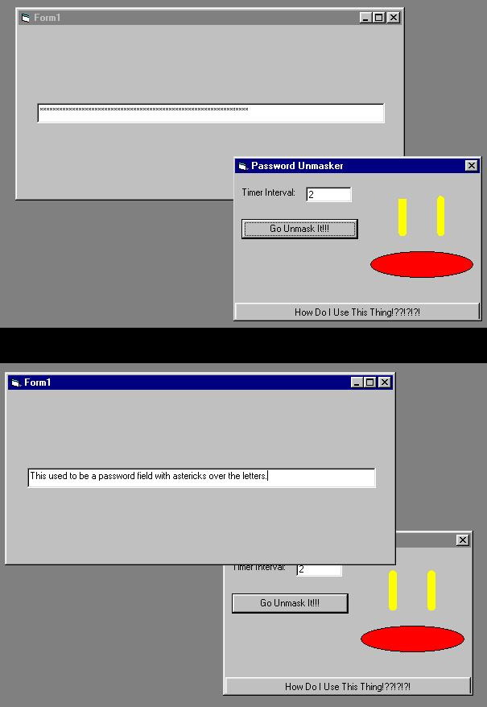



## A Working PW Unmasker

### Description

This is a working version of the password unmasker. You know when you enter a password sometimes and it is in astericks instead of text? This will change that. I found it will only work with other programs that are made in VB (it is impossible to make it work with non-VB programs, i tried.) I included a screen shot from where i made a new VB project with a text box /w a password char. I used my program and as you see in the screen shot, it decoded it. Just set the time limit to how many seconds it will take you to click on the textbox and click the "Go Unmask It!" button. Make sure you click on AND hold your mouse over the textbox (that you want to unmask) until you hear a bleep in the background from where a msgbox came up from the PW unmasker program. It works by sending advanced API calls to windows and telling it to reset the textbox's password char. property to nothing. Then next time the textbox is drawn again, there are no astericks. (After you click on the msgbox from my program saying it was unmasked, click on the textbox again to redraw it) Please leave comments and rate it on how you like it. Enjoy. =)

Oh yeah, and after you see the screen shot, i want you to leave a comment on how you like my MAD drawing skillz. =)

(the wonders of lines and shapes!)
 
### More Info
 

             |
---                |---
**Submitted On**   |2001-04-06 11:08:14
**By**             |[Harry Maugans](https://github.com/Planet-Source-Code/PSCIndex/blob/master/ByAuthor/harry-maugans.md)
**Level**          |Advanced
**User Rating**    |4.0 (20 globes from 5 users)
**Compatibility**  |VB 6\.0
**Category**       |[Complete Applications](https://github.com/Planet-Source-Code/PSCIndex/blob/master/ByCategory/complete-applications__1-27.md)
**World**          |[Visual Basic](https://github.com/Planet-Source-Code/PSCIndex/blob/master/ByWorld/visual-basic.md)
**Archive File**   |[A Working 18015462001\.zip](https://github.com/Planet-Source-Code/harry-maugans-a-working-pw-unmasker__1-22190/archive/master.zip)

